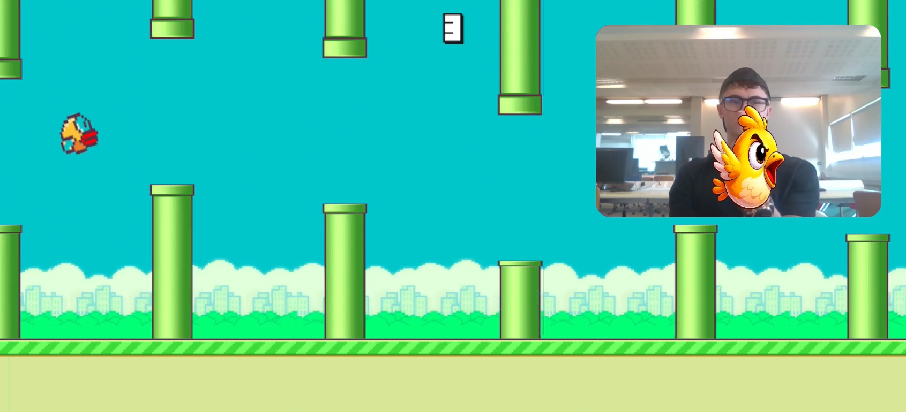
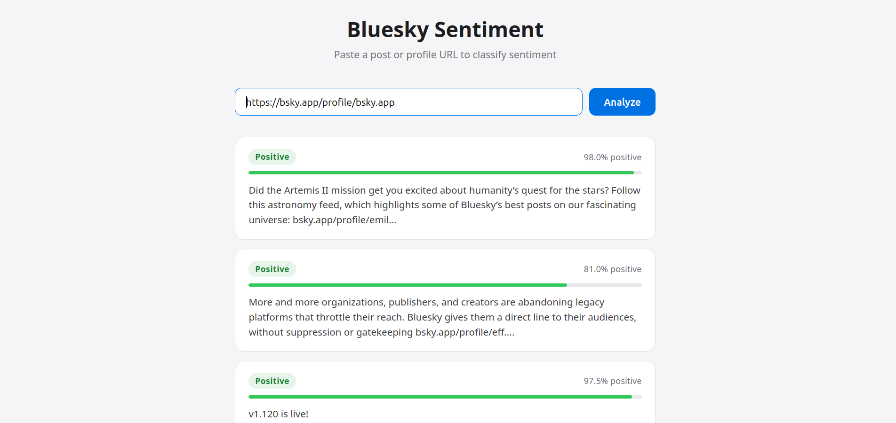

# Data Science Portfolio 2

## Setup

Requires [uv](https://docs.astral.sh/uv/).

```bash
uv sync --group dev
uv run jupyter notebook
```

This installs all dependencies (including the Jupyter kernel) into a managed virtual environment and launches the notebook server.

## 1. Premier League Over/Under 2.5 Goals

`premier_league.ipynb`

**Models:** SVM · K-Nearest Neighbours

8 seasons of Premier League data (3,040 matches). Rolling 5-game averages with lag-1 shifting are used as features to prevent data leakage, with a strict temporal train/test split to simulate real forecasting. Hyperparameters tuned via GridSearchCV. A betting simulation on the test set is included to evaluate practical value.

| Model | ROC-AUC | Betting P&L |
| ----- | ------- | ----------- |
| k-NN  | 0.510   | -€127       |
| SVM   | 0.569   | +€424       |

SVM's high recall (0.825) is the key driver of its profitability despite modest accuracy.

---

## 2. Customer Churn Prediction

`predict_customer_churn.ipynb`

**Models:** Random Forest · XGBoost

**K-Means clustering** (K=3) is applied to the numerical features to engineer a customer segment label, which is fed into two classifiers as an additional feature. Elbow curve and silhouette scoring were used to select K. The full preprocessing and modelling is wrapped in a single sklearn `Pipeline`.

| Model         | ROC-AUC |
| ------------- | ------- |
| Random Forest | 0.887   |
| XGBoost       | 0.914   |

Dataset: 594,194 telecom customers.

---

## 3. Middle Finger Censorship

`censorship.ipynb`

**Models:** MediaPipe BlazePalm CNN · Keras MLP

A two-stage neural network pipeline: MediaPipe detects 21 hand landmarks using a production-grade CNN (no training required), then a custom Keras MLP classifies the gesture from 5 engineered finger-extension ratio features. Detected gestures are censored in real time by drawing a black rectangle over the middle finger region using OpenCV. A rule-based classifier is also included as an interpretable baseline.

### Flippin' Bird

A browser-based Flappy Bird clone controlled by flipping the bird at your webcam. MediaPipe detects hand landmarks in real-time; the same middle-finger gesture classifier from the notebook triggers the flap. Built with HTML5 Canvas and vanilla JavaScript — no dependencies beyond MediaPipe. Spacebar, click, and touch are also supported as fallbacks.

- [Game](https://filip-melka.github.io/flippin-bird/) (should work on Google Chrome)
- [Repository](https://github.com/filip-melka/flippin-bird)



---

## 4. Stock Price Direction Prediction

`stock_trading.ipynb`

**Model:** Two-layer LSTM

Binary classification: predict whether AAPL's closing price will be higher or lower the next trading day. 5 years of daily OHLCV data sourced from the Alpaca Markets API. Three engineered features capture the relevant signal — log return (stationary price movement), intraday range as a fraction of close (volatility), and relative volume (unusual trading activity). Sequences of 20 trading days feed a stacked LSTM with dropout regularisation and early stopping. Temporal train/test split prevents data leakage.

| Metric   | Value |
| -------- | ----- |
| Accuracy | 0.52  |
| ROC-AUC  | 0.53  |

Modest accuracy is expected — the Efficient Market Hypothesis implies that publicly available information is largely priced in, leaving mostly noise. The project focuses on correctly framing the problem (stationarity, leakage prevention, appropriate metrics) rather than overfitting to spurious patterns.

---

## 5. Tic-Tac-Toe with Q-Learning

`tic_tac_toe.ipynb`

**Algorithm:** Q-Learning (tabular reinforcement learning)

A Q-learning agent learns to play tic-tac-toe from scratch — no rules are hard-coded. The agent plays as X against a random opponent over 50,000 training episodes, updating a Q-table via the Bellman equation after every move. Exploration decays from ε = 1.0 to 0.05 over training. An interactive ipywidgets board lets you play against the trained agent in the notebook.

| Metric                     | Value  |
| -------------------------- | ------ |
| Training episodes          | 50,000 |
| Unique states visited      | 2,391  |
| Win rate vs random (eval)  | 97.9%  |
| Loss rate vs random (eval) | 0.0%   |

The Q-table converges to a near-optimal policy: the agent wins the vast majority of games and never loses to a random opponent once training is complete.

---

## 6. Sentiment Classification

`sentiment_classification.ipynb`

**Model:** LSTM with learned word embeddings

Binary sentiment classification on the IMDB dataset (50,000 movie reviews). Reviews are tokenised as integer sequences using a 10,000-word vocabulary, padded to 200 tokens, and fed into a three-layer network: a learned `Embedding(10000, 32)` layer converts word IDs to dense vectors, an `LSTM(64)` reads the sequence and produces a fixed-size summary, and a sigmoid output neuron predicts positive vs. negative sentiment.

| Metric        | Value  |
| ------------- | ------ |
| Test Accuracy | 81.1%  |
| Test Loss     | 0.5685 |

Overfitting is visible from epoch 3 onward — validation loss rises while training loss continues to fall. The notebook also applies the trained model to live [Bluesky](https://bsky.app) posts via the public AT Protocol API.

### Web App

A Flask app (`app.py`) serves the trained model. Paste a Bluesky post or profile URL and it returns a sentiment score for each post.

```bash
uv run python app.py
```

The app loads `model.keras` at startup — run the notebook first to generate it.


